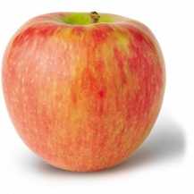

{: .box-success}
We are currently closed for the season. 
We will be opening August 31st for the 2024 season.

{: .mx-auto.d-block :}

**Family owned and operated since 1894**

## Our mission is to provide the authentic orchard experience for you and your family.

* No admission fee, no parking fees

* Pets are welcome

* Pick as little or as much as you like

* No petting zoo, no carnival, no water park – just great apples in a country atmosphere

## Location

We are located just south of Michigan City, Indiana.

8999 W 200 N Michigan City, IN 46360

Hours: 8:30am - 5:30pm Central Time (7 days a week) during our open season

Phone: (219) 872-3140

[Get Directions](https://www.google.com/maps/dir//8999%20W%20200%20N%2046360)

{: .mx-auto.d-block :}

